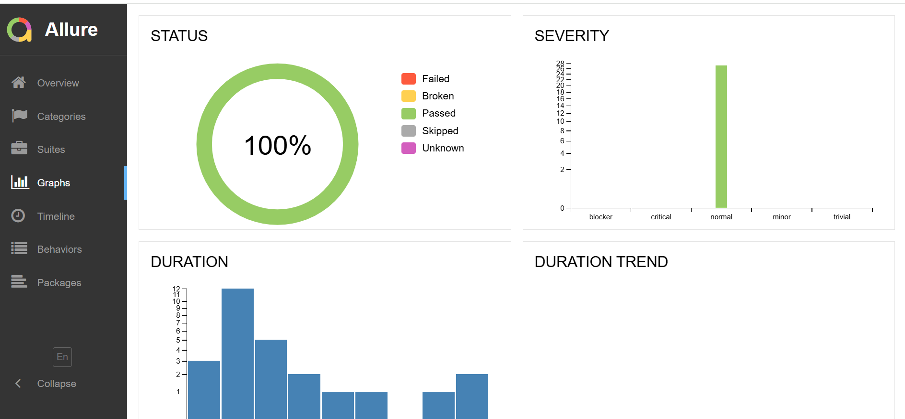
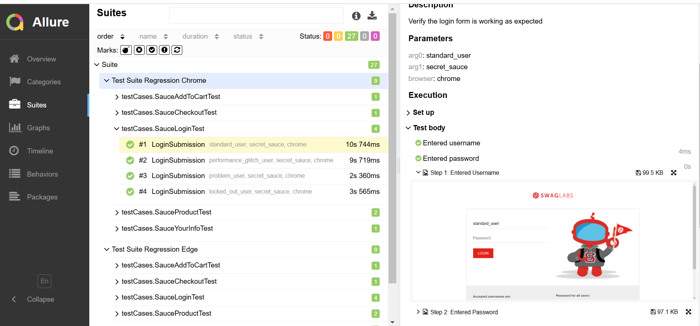

# Java Selenium(Java) Test Automation
## Description
This project is a test automation framework using Java, Selenium, Maven and TestNG. It includes automated tests for Sauce Lab/Swag Lab website, with reports generated using Allure.

## Features
- ‘Selenium’ Open-source automation tool for testing web applications.
- 'TestNG' for test management.
- 'Allure' for generating detailed test reports.
- 'Maven' as the build automation tool for dependency management.

## Prerequisites
- Java Development Kit (JDK)
- Maven
- Selenium
- TestNG
- Allure
- Web Browsers : Chrome, Edge and Mozilla Firefox

## Modules
The following modules are covered in the automation suite:
1.	Login: verify the login functionality with valid and invalid credentials.
2.	Product Display: Verify that the products are displayed correctly on the page.
3.	Add to Cart: Verify the user can add products to the shopping cart and confirms that the cart updates accurately.
4.	Personal Information Entry: Verify that the users can enter personal information during the checkout process.
5.	Checkout: Verify the end-to-end checkout process, ensuring that users can successfully complete a purchase.

## Steps to run
- Open project in Eclipse IDE.
- In 'Project Explorer', right click on testng.xml and select Run As-> TestNG suite.
Now automated test execution will begin

## Test Results
- The folder 'test_result' contains a video recording and screenshots of the test.

 

 

